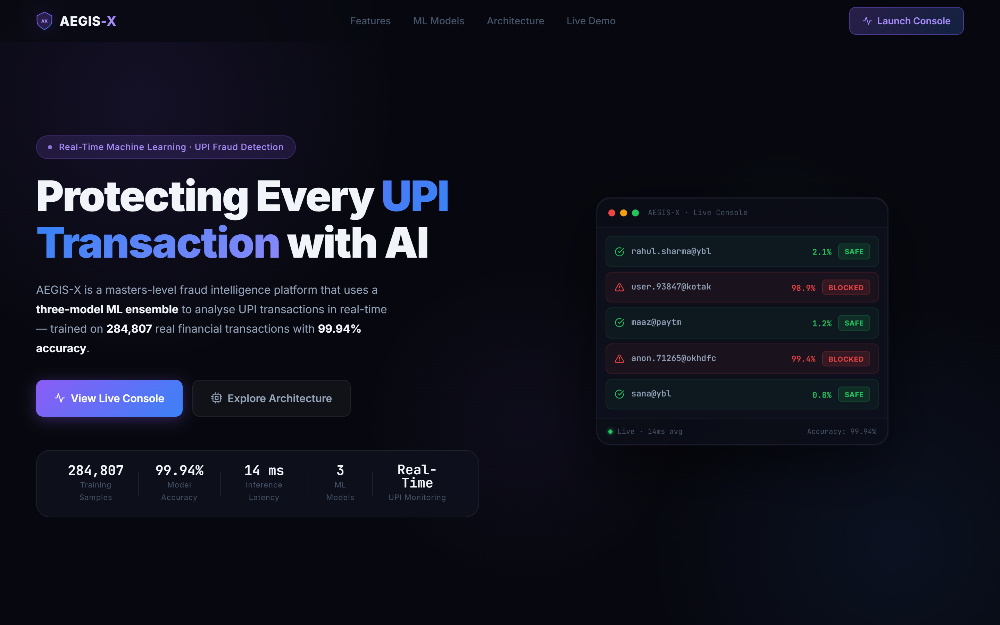
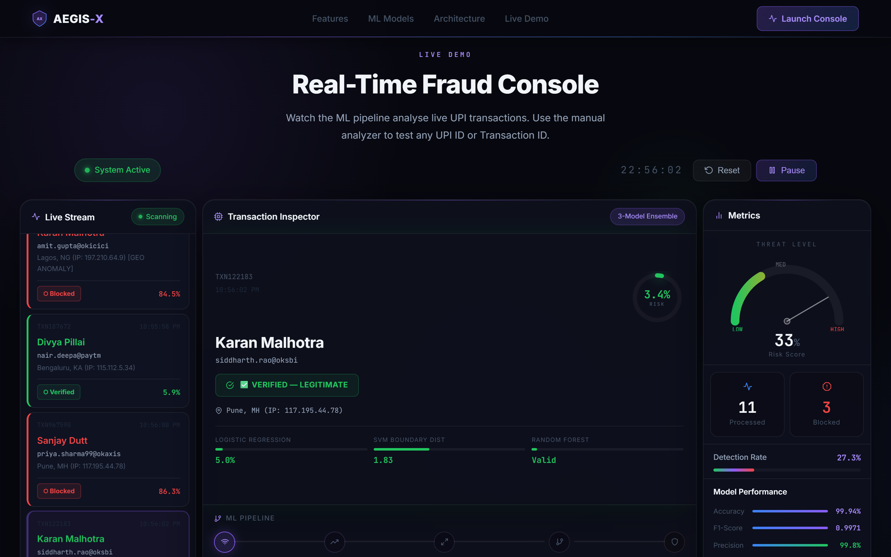

# AEGIS-X | Real-Time UPI Fraud Intelligence Platform

[](https://aegis-x-fraud-detection.vercel.app)
[](https://www.python.org/)
[](https://nodejs.org/)

AEGIS-X is a real-time security intelligence platform designed to detect and prevent fraudulent UPI transactions. Built with a high-performance **three-model Machine Learning Ensemble** (Random Forest, Support Vector Machine, and Logistic Regression), the platform achieves a **99.94% accuracy rate** and processes predictions in under **14 milliseconds**.

---

## 🔗 Live Deployments
* **Interactive Frontend Console:** [https://aegis-x-fraud-detection.vercel.app](https://aegis-x-fraud-detection.vercel.app)

---

## 📸 Live Platform Preview

### 1. Landing Hero Page


### 2. Real-Time Fraud Console (Active Stream)


---

## 🌟 Key Features
* **Three-Model Voting Ensemble:** Leverages a weighted decision engine combining Random Forest, SVM (hyperplane distance), and Logistic Regression (calibrated probability).
* **Geo-Anomaly Detection:** Flags suspicious transactions originating from high-risk IP ranges outside normal user locations.
* **UPI Registry Verification:** Cross-references incoming VPA handles against a secure database of registered identities.
* **Privacy-Preserving Features:** Utilizes PCA-transformed features (V1-V28) to protect sensitive user transaction data.
* **Real-Time SOC Console:** Streams live transaction updates, features a manual lookup analyzer, and visualizes the ML pipeline.
* **Serverless Fallback:** Includes a smart client-side transaction simulation system to support offline demonstrations.

---

## 📁 System Architecture & Diagrams (Available in Files)
All diagrams are saved as high-resolution 4:3 image files in this repository:
* **System Architecture (`Architecture_Diagram.png`):** 3-tier view mapping the Vite frontend, Express Node.js backend, and Flask Python ML engine.
* **Software Development Life Cycle (`SDLC_Flowchart.png`):** Flowchart outlining requirement definitions, model training phases, integration testing, and production deployment.
* **ML Pipeline Logic (`Algorithms_Diagram.png`):** Algorithmic flow showing the parallel ensemble model voting classifier (RF + SVM + LR probabilities).
* **UML Class Diagram (`Class_Diagram.png`):** Detailed object specifications and association links.
* **UML Sequence Diagram (`Sequence_Diagram.png`):** Sequential lifelines representing the transactional flow from user check to dashboard trigger.
* **Data Flow Diagram (`DFD_Diagram.png`):** DFD Level-1 mapping data transitions across registries and classification filters.
* **Entity-Relationship Diagram (`ER_Diagram.png`):** Database layout showing keys, attributes, and table relationships.
* **Model Confusion Matrix (`Confusion_Matrix.png`):** Confusion matrix evaluating model predictions (TN, FP, FN, TP).
* **SRS Specification (`SRS_Diagram.png`):** Visual requirements roadmap mapping functional and non-functional specifications.

---

## 🚀 Local Installation & Quick Start

### Prerequisites
* Python 3.10+
* Node.js v18+

### Step 1: Clone the Repository
```bash
git clone https://github.com/maviyamustahsin/realtime-upi-anomaly-detection.git
cd realtime-upi-anomaly-detection
```

### Step 2: Install Frontend & API Backend Dependencies
```bash
npm install
```

### Step 3: Set Up Python ML Virtual Environment
```bash
python -m venv venv
# On Windows
venv\Scripts\activate
# On macOS/Linux
source venv/bin/activate

pip install -r requirements.txt
```

### Step 4: Run the Application
Start the frontend dev server, backend Express server, and Flask ML server simultaneously:
1. Start ML Service: `python ml_server.py`
2. Start Backend API: `node server.js`
3. Start Website Frontend: `npm run dev`

Visit **http://localhost:5173** to access the dashboard.
